## Hey, I'm Matej 👋

## 22 • Notion Lover 🤍 • Full-Stack Web Developer 🌐 
 
- ⚡ Average Neovim Enjoyer
- 📄 Digital Products Creator
- 💪 Gym Rat creating SaaS with AI
- 🎓 Finished Bachelor's Degree at the Technical University of Košice

### Projects I've built:

<a href="https://makedock.vercel.app" target="_blank">MakeDock</a>
•
<a href="https://les-what2eat.vercel.app" target="_blank">What2Eat</a>
•
<a href="https://lrnwithai.vercel.app" target="_blank">LrnWithAI</a>
•
<a href="https://realtor-clone.matejbendik.com" target="_blank">Realtor clone</a>
•
<a href="https://promptzone.matejbendik.com" target="_blank">Promptzone</a>
•
<a href="https://www.matejbendik.com" target="_blank">Portfolio</a>
•
<a href="https://sortlen.matejbendik.com" target="_blank">Sortlen</a>
•
<a href="https://links.matejbendik.com" target="_blank">My Links</a>

### Connect with me:

 &nbsp;
 &nbsp;
 &nbsp;

### Languages and Tools:

  

 

---

 
---

